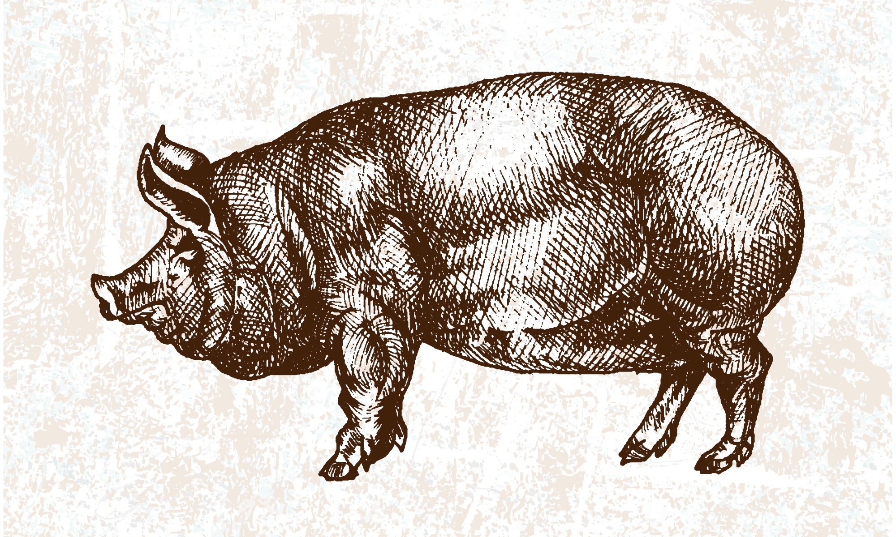

# 🐷 ReConta

<p style="text-align: center;">
  
</p>

## Uso

Instalar as dependências:

```bash
bun install
```

Rodar em modo de desenvolvimento:

```bash
bun apps/site/index.ts
```

## 📰 Referências

- Soon...

## 🕐 ChangeLog

- `2024/06/16` - Basic scaffolding using [Bun Workspaces](https://github.com/sistematico/bun-workspaces-template)

This project was created using `bun init` in bun v1.1.13.
[Bun](https://bun.sh) is a fast all-in-one JavaScript runtime.
